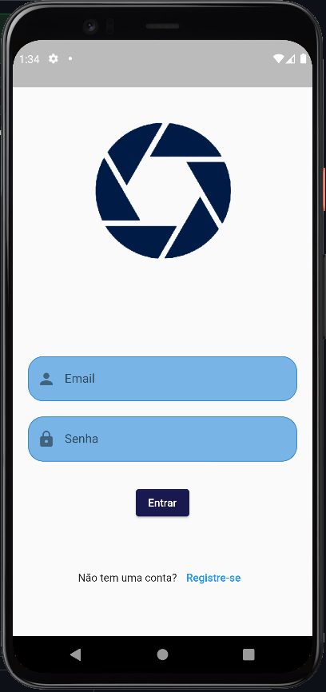
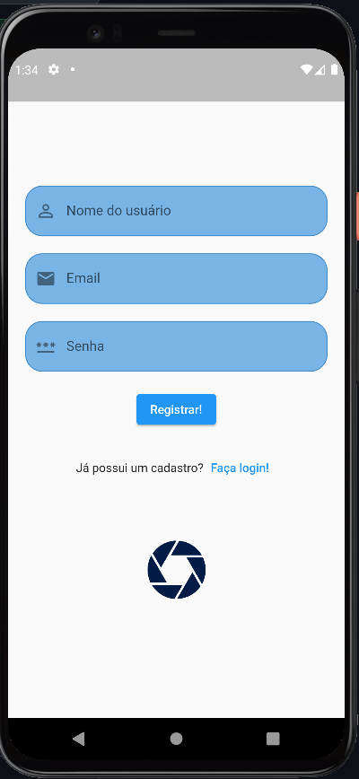
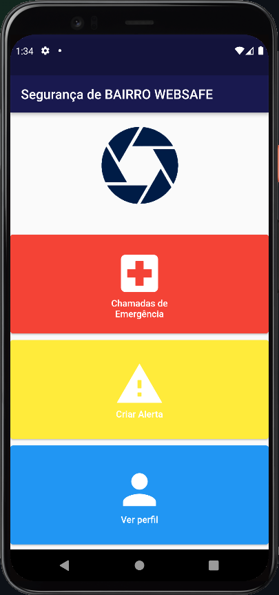
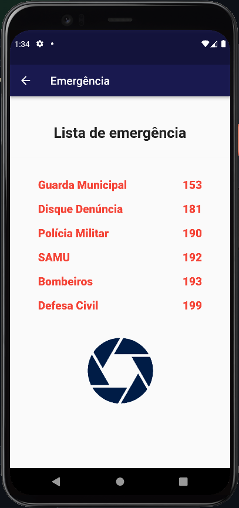
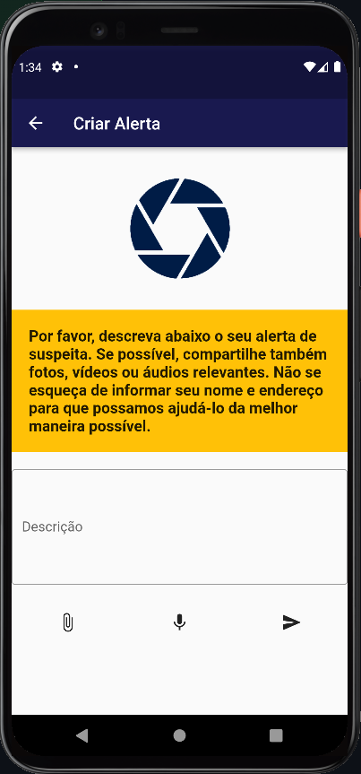
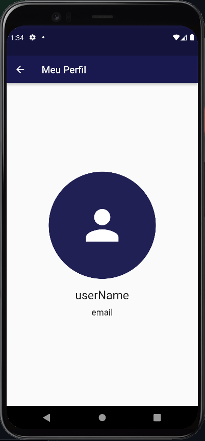

<header>
	<h1>SBWS - Segurança do Bairro 📷 </h1> 
	
Protótipo para Android desenvolvido com Dart, Flutter, Proto IO e SQFLITE

</header>
	
<section>
	<h2>Descrição</h2>
	
O SBWS é um aplicativo voltado para a segurança do seu bairro, permitindo que os usuários acionem alertas de suspeitas, solicitem chamadas diretas para empresas de segurança vinculadas ao app para rondas ou atendimento em casos de emergência e até mesmo peçam socorro diretamente para a polícia, sem precisar passar por triagem. As funções do aplicativo incluem login, cadastro pessoal, chamadas de emergência e criação de alertas, permitindo que os usuários adicionem fotos, vídeos ou áudios para explicar o ocorrido. As telas são de fácil manuseio e apresentam um design intuitivo.

	
<a href="https://docs.google.com/document/d/1NRLK2XpsykJJ8yZR5DU5uC1oj27GRVIxFVxIkcCU-fs/edit?usp=sharing">Link documento do projeto

</section>
		
<section>
	<h2>Tecnologias Utilizadas</h2>
	<ul>
		<li></li>
		<li></li>
		<li></li>
		<li></li>
	</ul>
	</section>
		
<section>
	<h2>Capturas de Tela</h2>
	
	
	
	
	
	
</section>
		
<section>
	<h2>Como Instalar</h2>
	<ol>
		<li>Faça o download do APK do aplicativo.</li>
		<li>Abra o APK no seu dispositivo Android, talvez precise de algum emulador.</li>
		<li>Siga as instruções de instalação.</li>
		<li>Abra o aplicativo e faça o login ou cadastro.</li>
		<li>Comece a utilizar!</li>
	</ol>
</section>

	
<footer>
	
&copy; 2023 SBWS - Segurança do Bairro

</footer>
